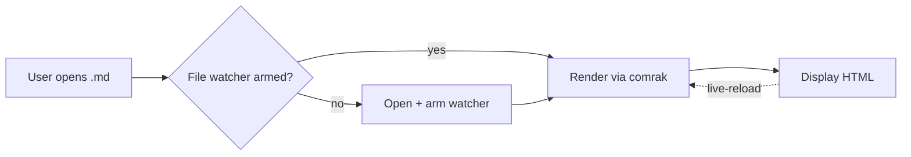
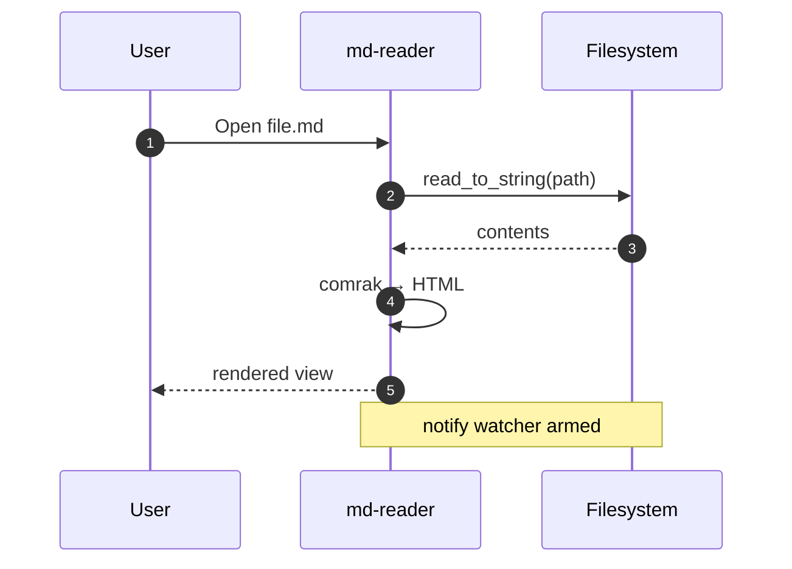

# md-reader sample document

A torture test for every Markdown construct Claude, ChatGPT, and friends
typically emit. If anything looks off in the rendered view, that's where to
go fix CSS in `src/lib/Viewer.svelte`.

> Subtitle-style blockquote — useful as a one-line intro to a doc.

---

## Inline text

Plain paragraphs of text with **bold**, *italic*, ***bold italic***,
~~strikethrough~~, `inline code`, [an external link](https://github.com),
and an autolink: <https://example.com>.

Here is some text with a footnote reference[^1]. And here's another one[^big].

You can also use H<sub>2</sub>O and 6.022 × 10<sup>23</sup>, plus
<kbd>Ctrl</kbd>+<kbd>Shift</kbd>+<kbd>P</kbd> for keyboard hints.

## GFM Alerts (all 5)

> [!NOTE]
> Highlights information that users should take into account, even when
> skimming. Multi-line is fine.

> [!TIP]
> Optional information to help a user be more successful.

> [!IMPORTANT]
> Crucial information necessary for users to succeed.

> [!WARNING]
> Critical content demanding immediate user attention due to potential risks.

> [!CAUTION]
> Negative potential consequences of an action.

## Lists

Unordered, with nesting:

- Top-level item
- Another top-level
  - Nested
    - Deeper
  - Back one level
- And another

Ordered:

1. First
2. Second
   1. Nested-ordered
   2. And another
3. Third

Task list (typical Claude todo output):

- [x] Set up project scaffolding
- [x] Wire IPC commands
- [ ] Verify file association on Explorer
- [ ] Sign Windows installer
- [ ] Ship v0.1

Mixed paragraph inside a list item:

1. Step one — do the thing.

   This is a follow-up paragraph still inside step 1, with `code` and a
   nested bullet:

   - sub-bullet alpha
   - sub-bullet beta

2. Step two.

## Tables

| Tool       | Type           | Footprint | Maintained |
|------------|----------------|-----------|------------|
| md-reader  | viewer-first   | ~10 MB    | yes        |
| VS Code    | editor + ext   | ~350 MB   | yes        |
| Obsidian   | vault PKM      | ~250 MB   | yes        |
| Typora     | WYSIWYG editor | ~94 MB    | paid       |
| MarkText   | WYSIWYG editor | ~150 MB   | abandoned  |

Alignment:

| Left   | Center | Right |
|:-------|:------:|------:|
| a      |   b    |     c |
| longer | mid    |     1 |

## Code

Inline `let mut x = 42;` and a fenced block:

```rust
fn fibonacci(n: u32) -> u64 {
    let (mut a, mut b) = (0u64, 1u64);
    for _ in 0..n {
        let t = a + b;
        a = b;
        b = t;
    }
    a
}
```

```typescript
async function load(path: string): Promise<string> {
  const res = await fetch(path);
  if (!res.ok) throw new Error(`HTTP ${res.status}`);
  return res.text();
}
```

```python
def quicksort(xs):
    if len(xs) <= 1:
        return xs
    pivot = xs[len(xs) // 2]
    return (quicksort([x for x in xs if x < pivot]) +
            [x for x in xs if x == pivot] +
            quicksort([x for x in xs if x > pivot]))
```

```bash
# A shell snippet — typical Claude install instructions
npm install
npm run tauri dev
```

A code fence with no language tag:

```
plain text inside a fenced block
preserves   exact   spacing
```

## Math

Inline math: $E = mc^2$, $\pi \approx 3.14159$, and
$\sum_{i=0}^{n} i = \frac{n(n+1)}{2}$.

A block:

$$
\int_{-\infty}^{\infty} e^{-x^2} \, dx = \sqrt{\pi}
$$

A more complex block — matrices:

$$
A = \begin{pmatrix} 1 & 0 & 0 \\ 0 & 1 & 0 \\ 0 & 0 & 1 \end{pmatrix}
$$

## Mermaid diagram





## Blockquote nesting

> A primary quote.
>
> > A nested quote inside the primary one.
> >
> > > Triple-nested for good measure.

## Long paragraph

Lorem ipsum dolor sit amet, consectetur adipiscing elit. Sed do eiusmod
tempor incididunt ut labore et dolore magna aliqua. Ut enim ad minim
veniam, quis nostrud exercitation ullamco laboris nisi ut aliquip ex ea
commodo consequat. Duis aute irure dolor in reprehenderit in voluptate
velit esse cillum dolore eu fugiat nulla pariatur. Excepteur sint occaecat
cupidatat non proident, sunt in culpa qui officia deserunt mollit anim id
est laborum.

## Horizontal rule

Some text above the rule.

---

Some text below the rule. The line above should span the full content
width of the document.

## Definition list

Markdown
: A lightweight markup language with plain-text formatting syntax.

CommonMark
: A strongly defined, highly compatible specification of Markdown.

GFM
: GitHub Flavored Markdown — CommonMark plus tables, task lists,
  strikethrough, and autolinks.

---

Footnotes appear at the bottom of the document.

[^1]: This is a short footnote. It should appear in the footnotes section
      below with a backreference arrow.

[^big]: This footnote has more content — multiple sentences, even. It
      demonstrates that comrak handles multi-paragraph footnotes correctly.

      A second paragraph of the same footnote.
