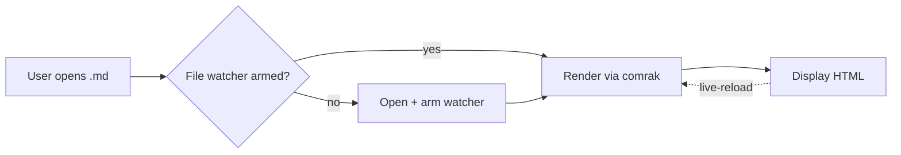

# md-reader sample document

Drop this into the app to verify the rendering pipeline.

## Text features

This paragraph has **bold**, *italic*, ~~strikethrough~~, `inline code`, and a
[link to the project](https://github.com).

> A blockquote. Useful for callouts.
> Multi-line is fine.

## GFM alerts

> [!NOTE]
> Useful information.

> [!WARNING]
> Critical information that needs attention.

## Lists

- Plain bullet
- Another
  - Nested
- [x] Task done
- [ ] Task pending

1. Numbered
2. Items

## Code

```rust
fn fibonacci(n: u32) -> u64 {
    let (mut a, mut b) = (0u64, 1u64);
    for _ in 0..n {
        let t = a + b;
        a = b;
        b = t;
    }
    a
}
```

```typescript
async function load(path: string): Promise<string> {
  const res = await fetch(path);
  return res.text();
}
```

## Math

Inline: $E = mc^2$ and $\sum_{i=0}^n i = \frac{n(n+1)}{2}$.

Block:

$$
\int_{-\infty}^{\infty} e^{-x^2} \, dx = \sqrt{\pi}
$$

## Tables

| Tool      | Footprint | Maintained |
|-----------|-----------|------------|
| md-reader | ~10 MB    | yes        |
| VS Code   | ~350 MB   | yes        |
| Obsidian  | ~250 MB   | yes        |

## Mermaid diagram



## Footnotes

Here's a fact[^1] that needs citing.

[^1]: This is the citation.

---

Try editing this file in another window — the view should update live.
