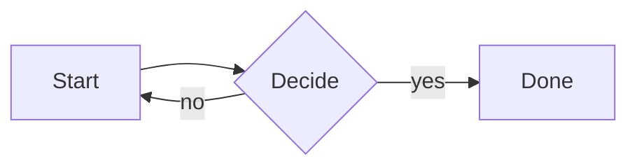

# Round-trip fixture

A grab-bag document used to verify that **smart edit mode** preserves
markdown faithfully on save. Open this in md-reader, switch to Smart edit,
make no changes, save — diff should be a no-op (or show only documented
normalisations like `*` ↔ `_`).

## Headings

# H1
## H2
### H3
#### H4

## Inline marks

This paragraph has **bold**, *italic*, ~~strikethrough~~, and `inline code`.
Combinations: ***bold italic*** and **bold with `code` inside**.

## Lists

Unordered, with nesting:

- First
- Second
  - Nested second-level
    - Third level
- Back to top level

Ordered, with continuation paragraphs:

1. First item.

   Continuation paragraph that belongs to item 1.

2. Second item.
3. Third item.

Tasks:

- [x] Done
- [ ] Not done
- [ ] With **bold** inside

## Links and images

A [link to nowhere](https://example.com/path?q=1) and a relative one
to [the README](../README.md).


## Blockquote

> Plain blockquote.
>
> With a second paragraph.

## Table

| Col A | Col B  | Col C |
| ----- | ------ | ----: |
| one   | two    |     3 |
| four  | five   |     6 |
| seven | eight  |     9 |

## Code block

```ts
function greet(name: string): string {
  return `Hello, ${name}!`;
}
```

## Math

Inline: $E = mc^2$.

Display:

$$
\int_0^1 x^2 \, dx = \tfrac{1}{3}
$$

## Mermaid



## GFM alert

> [!NOTE]
> This is a GitHub-style note callout. Round-tripping these is a known
> tricky case — flag any deviation from the source above.

## Footnotes

Here is a footnote reference[^1].

[^1]: And the footnote definition.

## Horizontal rule

---

End.
